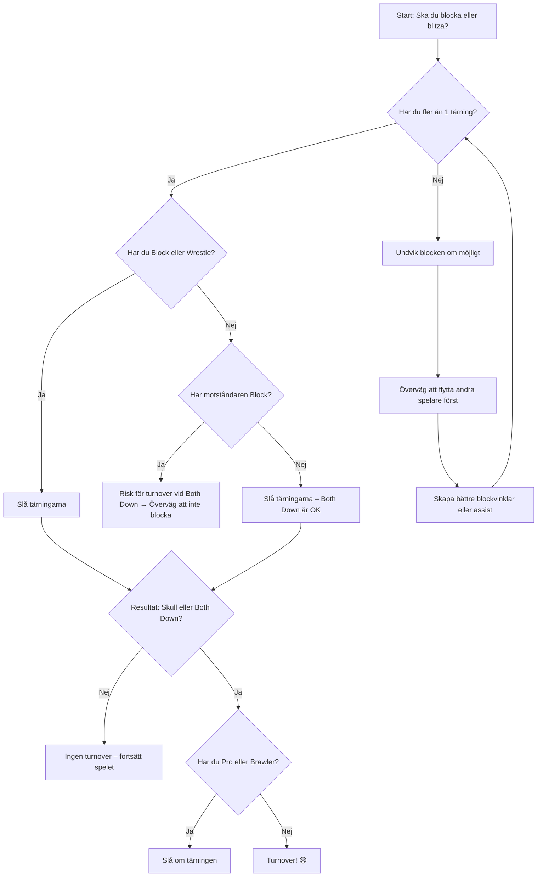

```mermaid
flowchart TD
    A[Start: Ska du blocka eller blitza?] --> B{Har du fler än 1 tärning?}
    B -- Ja --> C{Har du Block eller Wrestle?}
    B -- Nej --> D[Undvik blocken om möjligt]
    C -- Ja --> E[Slå tärningarna]
    C -- Nej --> F{Har motståndaren Block?}
    F -- Ja --> G[Risk för turnover vid Both Down → Överväg att inte blocka]
    F -- Nej --> H[Slå tärningarna – Both Down är OK]
    E --> I{Resultat: Skull eller Both Down?}
    H --> I
    I -- Nej --> J[Ingen turnover – fortsätt spelet]
    I -- Ja --> K{Har du Pro eller Brawler?}
    K -- Ja --> L[Slå om tärningen]
    K -- Nej --> M[Turnover! 😢]

    D --> N[Överväg att flytta andra spelare först]
    N --> O[Skapa bättre blockvinklar eller assist]
    O --> B
```
